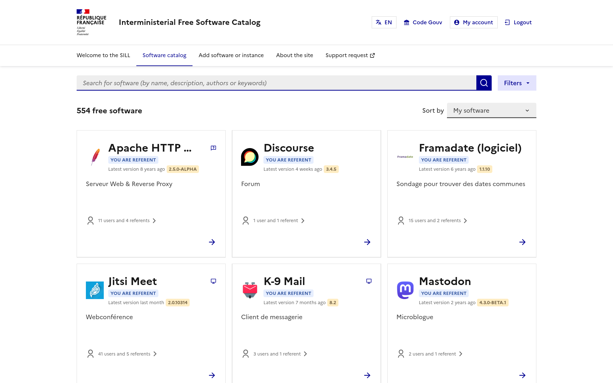

# Catalogi

## A Software Catalog application

This repository contains Catalogi, a web application to manage software catalogs.

## Documentation

Documentation is available [here](https://codegouvfr.github.io/catalogi/)

## Catalogi deployments

1. [https://code.gouv.fr/sill](https://code.gouv.fr/sill/) is the list of recommanded Free Software for French administrations.
2. [https://logiciels.catalogue-esr.fr/](https://logiciels.catalogue-esr.fr/) list [HAL](https://hal.science/) for the French Ministry of Research.

## Code organization

This monorepo is made of several directories:

- `api/`: Application API (also includes jobs, that can be run periodically)
- `web/`: Web frontend
- `docs/`: Documentation, as deployed [here](https://codegouvfr.github.io/catalogi/)
- `deploy-examples/`: Deployment examples. For now only a Docker Compose example.

## Governance and contributions

See [GOVERNANCE](GOVERNANCE.md) and [CONTRIBUTING](CONTRIBUTING.md).

## License

2021-2025 Direction interministérielle du numérique, mission logiciels libres.

The code in this repository is published under [licence MIT](LICENSES/MIT.txt).

The documentation is published under [licence Ouverte 2.0](LICENSES/Etalab-2.0.md) and [CC-BY-4.0](LICENSES/CC-BY-4.0.txt).
